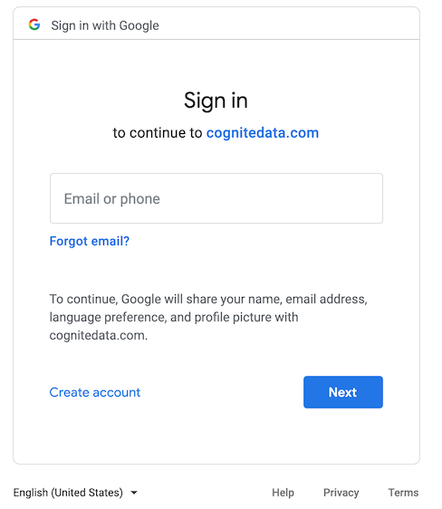
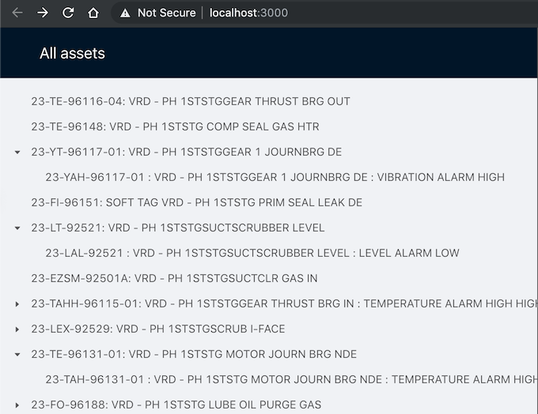

# Hello Gearbox

> Introductory example app demonstrating how to access the `Cognite Data Fusion Platform` with the `JavaScript SDK` and the `Cognite Gearbox` component library.

Run with:

```shell
npm install

HTTPS=true npm start
```

Default web browser should open automatically at https://localhost:3000

## Tech stack

This is a single page app bootstraped with
[Create React App](https://facebook.github.io/create-react-app/docs/getting-started).

Following libraries/tools are used:

- [`@cognite/gearbox`](https://github.com/cognitedata/gearbox.js) - React components- styled with Ant Design, for working with the Cognite Data Fusion data model
- [`@cognite/sdk`](https://github.com/cognitedata/cognitesdk-js) - JavaScript SDK for accessing the Cognite Data Fusion platform
- [`antd`](https://github.com/ant-design/ant-design) - UI [design language](https://ant.design/docs/spec/introduce) and an implementation of that as a set of [React components](https://ant.design/docs/react/introduce)
- [`react`](https://github.com/facebook/react) - UI library

## Example walkthrough

Application entry point is [index.js](src/index.js)- where the `App` component gets
mounted to browser DOM at the `<div id="root"></div>` element.

Just after getting mounted, the [App](src/App.js) component uses
[CogniteClient](https://cognitedata.github.io/cognitesdk-js/classes/cogniteclient.html)
from the [Cognite JavaScript SDK](https://github.com/cognitedata/cognitesdk-js) to establish a connection with the
[Cognite Data Fusion](https://cognite.com/products/cognite-data-fusion/) platform.

```js
async componentDidMount() {
  const client = new CogniteClient({
    appId: "hello-cdf-gearboxjs"
  });

  client.loginWithOAuth({ project: "publicdata" });
  client.authenticate().then(() => {
    this.setState({ client });
  });
}
```

The `CogniteClient` component nicely packages the complexity of authentication
against a provider (Google in this case), and making API requests.



A reference to this client is stored in the `App` component's state and made available 
to the children of the `App` component via the `ClientSDKProvider` component from 
[Cognite Gearbox](https://github.com/cognitedata/gearbox.js) component toolkit.

```html
<ClientSDKProvider client={this.state.client}>
  <Explorer />
</ClientSDKProvider>
```

The [Explorer](src/Explorer.js) component utilizes an
[AssetTree](https://cognitedata.github.io/gearbox.js/?path=/story/assettree--full-description)
component to display a list of assets from the
[Open Industrial Data](https://openindustrialdata.com) project.



When one of these assets are selected, it's detail are displayed by utilizing an
[AssetMeta](https://cognitedata.github.io/gearbox.js/?path=/story/assetmeta--full-description) component.


